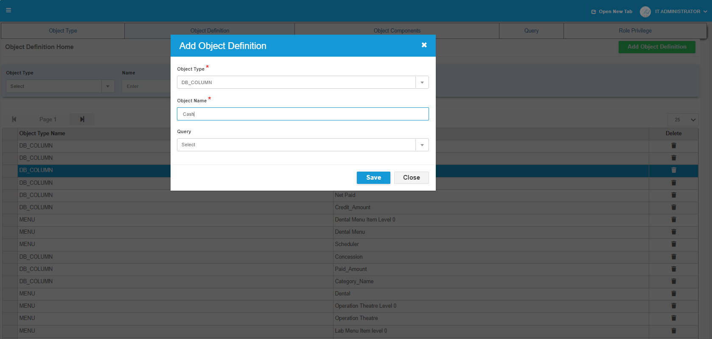
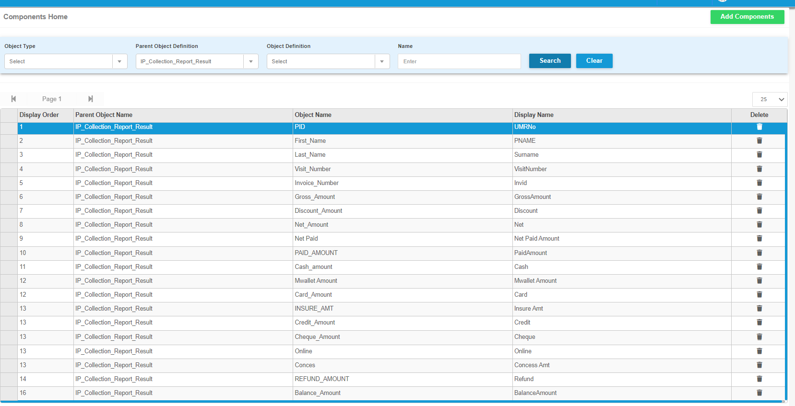
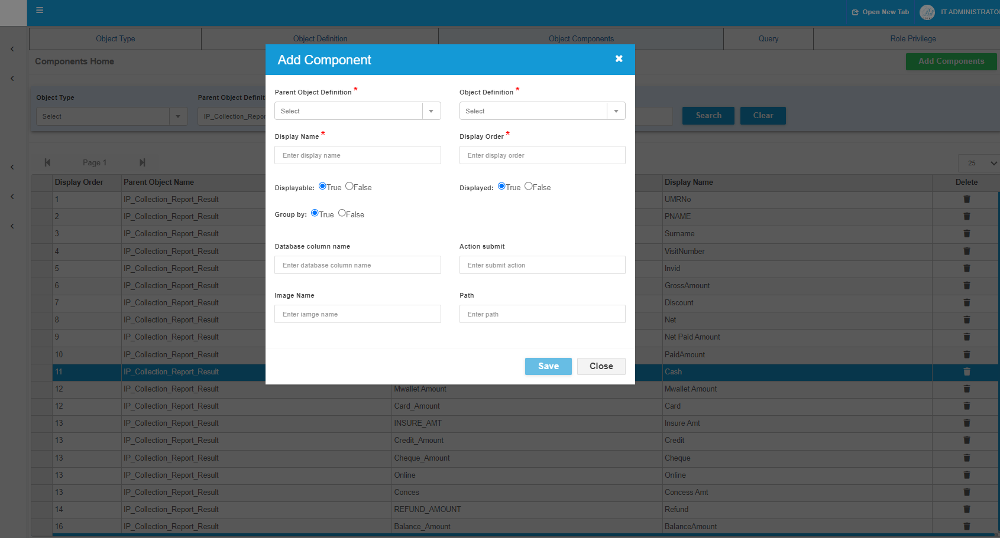
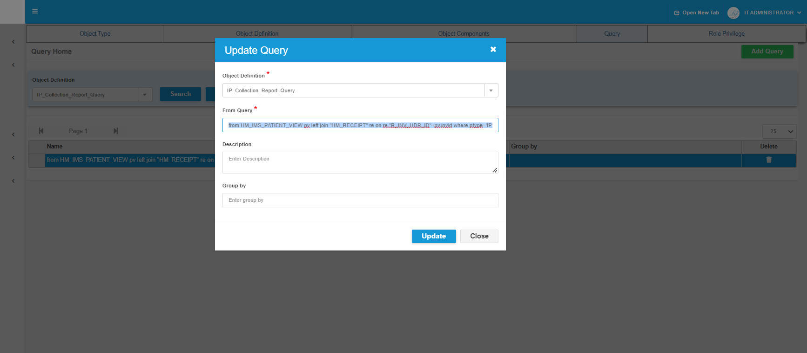

 
## Add Object Definition 
#### 1.Cash
#### 2.Conces
#### 3.INSURE_AMT
#### 4.Online
#### 5.Mwallet Amount
#### 6.NetPaid
#### 7.CreditAmt

 
 

##### Here List of For IP Collection Report Result 

 
 
 

## Add Component 
1. For Cash
2. card
3. mobile wallet
4. net paid
5. credit
6. concession amount
7. like what we need in or missing the the columns in your list 

Group by is False For Payment Modes 

 
 

If Cash --> query example
SUM(CASE WHEN (re."R_RECEIPT_TYPE"<> 'RF' AND re."R_PAYMENT_MODE" ='CSH') THEN re."R_PAID_AMOUNT" ELSE 0 END)

 

like Card, mobile wallet, card, credit,etc for payment modes

Net PAid Amount is ---> Query --> pv.paid

Net Amount is --> Query --> pv.net

For Refund --> Query --> SUM(CASE WHEN(re."R_RECEIPT_TYPE" = 'RF') THEN re."R_PAID_AMOUNT" ELSE 0 END)

For Concession --> Query ---> SUM(CASE WHEN (re."R_RECEIPT_TYPE"<> 'RF' AND re."R_PAYMENT_MODE" ='CONCES') THEN re."R_PAID_AMOUNT" ELSE 0 END)

For Balance --> pv.balance

Paid Amount is ---> SUM(CASE WHEN(re."R_RECEIPT_TYPE"<> 'RF' ) THEN re."R_PAID_AMOUNT" ELSE 0 END)

 
 

## Update the Query For IP Collection Report Query

from HM_IMS_PATIENT_VIEW pv left join "HM_RECEIPT" re on re."R_INV_HDR_ID"=pv.invid where ptype='IP' and (re."R_STATUS" is null)

Payment Modes

|Sno|Payment Mode | Code |
|--------|--------|--------|
|1|Cash | CSH|
|2|Online | ONLINE |
|3|CREDIT | CRDT|
|4|CHEQUE| CHQ|
|5|Card | CRD|
|6|Moblie Wallet | MWALLET|
|7|INSURANCE | INSURE|
|8|Concession | CONCES|
|9|Corporate Discount | CORPDISC|

